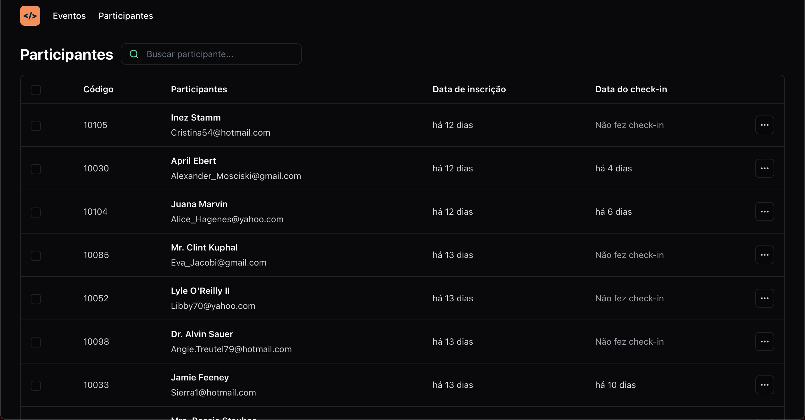
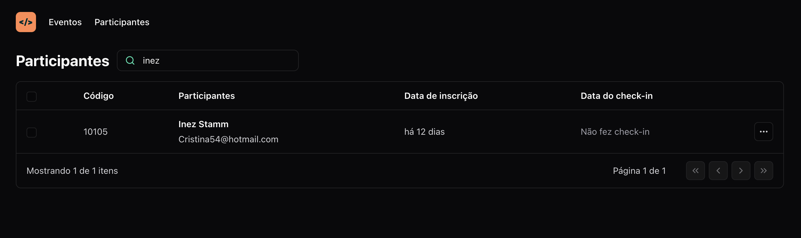

# react-unite-checkin
Check-in App developed using React 

## Front-end project developed during Rocketseat's NLW - UNITE

## pass.in 

Pass.in is an application developed for **managing participants in in-person events.**

The tool allows the organizer to register an event and open a public registration page.
Registered participants can issue a credential for check-in on the day of the event.
The system will scan the participant's credentials to allow entry to the event.

## Technologies used 

- Reactjs
- Typescript
- Vite
- Tailwind CSS
- Nodejs API
- URL states

## How to execute the App with Database

- Clone this repository
- Download nodejs and npm Installer
- Install node packages
- On terminal, use npm run dev
- Clone this nodejs API: [Rocketseat's API](https://github.com/rocketseat-education/nlw-unite-nodejs)
- Install node packages
- npm run dev
- And it's good to go!

## Front-end View 

